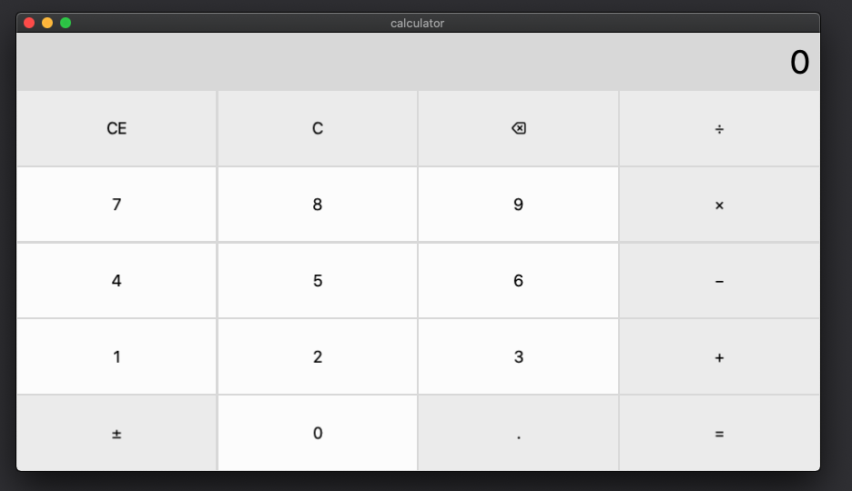

# intro-to-react-native-on-macos

This project accompany's my [LogRocket post on an intro to React Native with macOS](https://blog.logrocket.com/hands-on-react-native-macos/).

The project in the `ReactNativeFirstProject` folder is a React Native project generated with the [Expo CLI](https://docs.expo.io/get-started/installation/).

The project in the `calculator` folder is a modified version of the [React Native calculator example here](https://github.com/microsoft/react-native-windows-samples/tree/master/samples/Calculator). This project is specifically a React Native for macOS calculator.

To learn more I recommend reviewing the official documentation for React Native [here](https://reactnative.dev/) as well as the Microsoft site on React Native for macOS [here](https://microsoft.github.io/react-native-windows/docs/rnm-getting-started).
